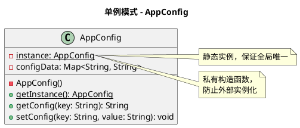
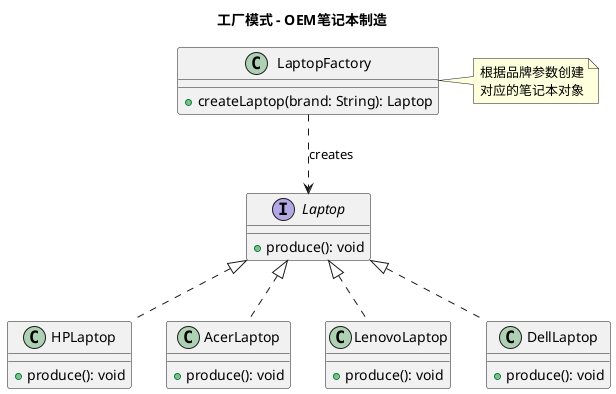
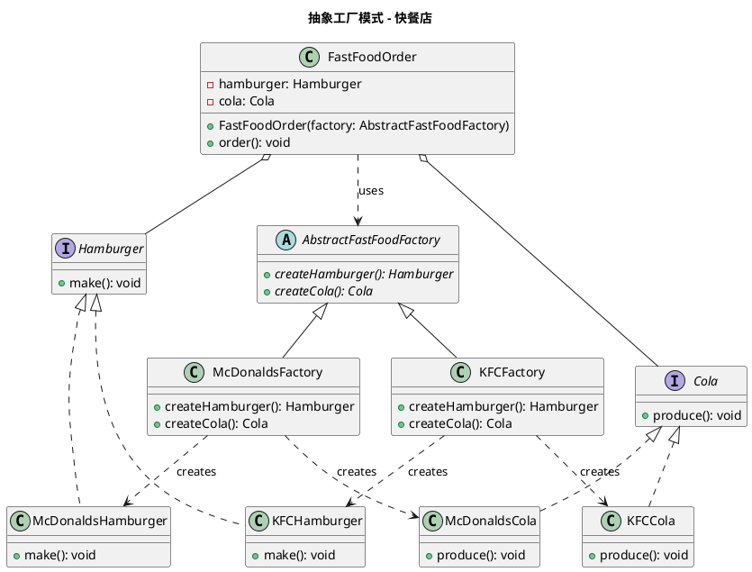
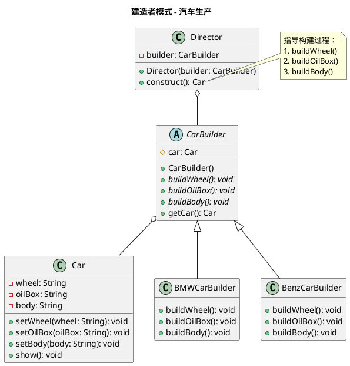
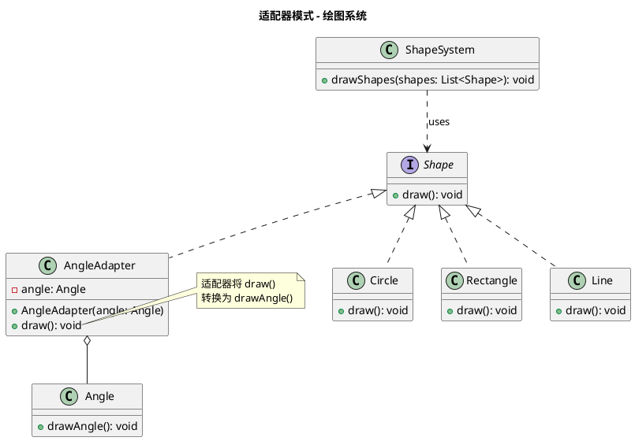
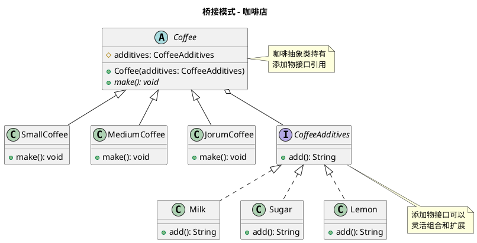
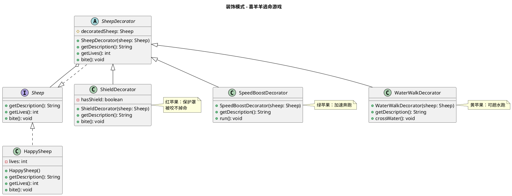
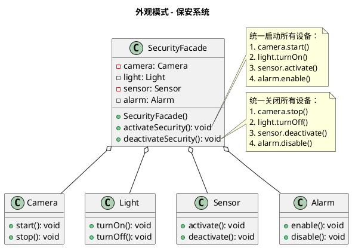
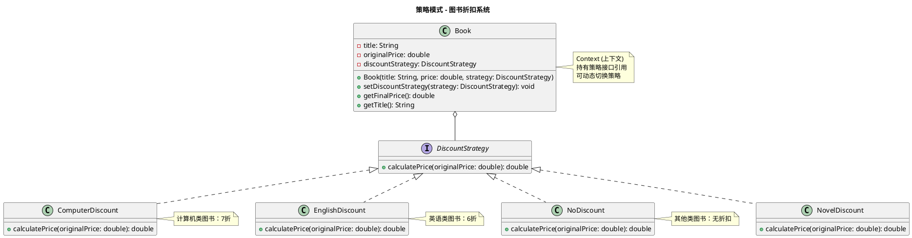

# 软件设计与体系结构 - 设计模式作业汇总

**教师**：张凯、邱晨、王磊  
**完成日期**：2025年11月9日

---

## 目录

1. [单例模式（Singleton）](#作业一单例模式的应用)
2. [工厂模式（Factory）](#作业二工厂模式的应用)
3. [抽象工厂模式（Abstract Factory）](#作业三抽象工厂模式的应用)
4. [建造者模式（Builder）](#作业四建造者模式的应用)
5. [适配器模式（Adapter）](#作业五适配器模式的应用)
6. [桥接模式（Bridge）](#作业六桥接模式的应用)
7. [装饰模式（Decorator）](#作业七装饰模式的应用)
8. [外观模式（Facade）](#作业八外观模式的应用)
9. [观察者模式（Observer）](#作业九观察者模式的应用)
10. [策略模式（Strategy）](#作业十策略模式的应用)

---

## 作业一：单例模式的应用

### 1. 题目要求

#### 目的

1. 掌握单例模式（Singleton）的特点
2. 分析具体问题，使用单例模式进行设计

#### 内容和要求

很多应用项目都有配置文件，这些配置文件里面定义一些应用需要的参数数据。通常客户端使用这个类是通过 `new` 一个 `AppConfig` 的实例来得到一个操作配置文件内容的对象。如果在系统运行中，有很多地方都需要使用配置文件的内容，系统中会同时存在多份配置文件的内容，这会严重浪费内存资源。事实上，对于 `AppConfig` 类，在运行期间，只需要一个对象实例就够了。

✅ **任务**：

- 用 Java 控制台应用程序实现该单例模式
- 绘制该模式的 UML 类图

### 2. 解决方案

#### 核心代码实现

**AppConfig.java - 单例类**

```java
package DesiginPatternHomework.Singleton;

import java.util.HashMap;
import java.util.Map;

public class AppConfig {
    // volatile关键字确保多线程环境下的可见性和有序性
    private static volatile AppConfig instance;
    private static final Object lockObject = new Object();

    // 私有构造函数，防止外部实例化
    private AppConfig() {
        loadConfig();
    }

    private Map<String, String> configData;

    // 双重检查锁定（Double-Checked Locking）
    public static AppConfig getInstance() {
        if (instance == null) {
            synchronized (lockObject) {
                if (instance == null) {
                    instance = new AppConfig();
                }
            }
        }
        return instance;
    }

    private void loadConfig() {
        configData = new HashMap<>();
        configData.put("key1", "value1");
        configData.put("key2", "value2");
        configData.put("key3", "value3");
        System.out.println("配置文件已加载");
    }

    public String getConfigValue(String key) {
        return configData.getOrDefault(key, "");
    }

    public void setConfigValue(String key, String value) {
        configData.put(key, value);
    }
}
```

**Main.java - 测试类**

```java
package DesiginPatternHomework.Singleton;

public class Main {
    public static void main(String[] args) {
        AppConfig appConfig = AppConfig.getInstance();
        AppConfig appConfig2 = AppConfig.getInstance();
        System.out.println(appConfig == appConfig2);  // true
        System.out.println(appConfig);
        System.out.println(appConfig2);
    }
}
```

### 3. 设计要点

#### 单例模式特点

1. **私有构造函数**：防止外部通过 `new` 创建实例
2. **静态实例变量**：使用 `volatile` 关键字确保多线程可见性
3. **双重检查锁定**：既保证线程安全，又提高性能
4. **全局访问点**：通过 `getInstance()` 方法获取唯一实例

#### 优势

- 节省内存资源（只创建一个实例）
- 提供全局访问点
- 线程安全

### 4. UML类图



---

## 作业二：工厂模式的应用

### 1. 题目要求

#### 目的

1. 掌握工厂模式（Factory）的特点
2. 分析具体问题，使用工厂模式进行设计

#### 内容和要求

有一个 OEM 制造商代理做 HP 笔记本电脑（Laptop），后来该制造商得到了更多品牌订单：Acer、Lenovo、Dell。该 OEM 商发现，如果一次同时生产多个品牌的笔记本，不利于管理。

✅ **任务**：

- 利用工厂模式改善设计
- 用 Java 控制台应用程序实现该 OEM 制造商的工厂模式
- 绘制该模式的 UML 类图

### 2. 解决方案

#### 核心代码实现

**Laptop.java - 抽象产品类**

```java
package DesiginPatternHomework.Factory;

public abstract class Laptop {
    protected String brand;
    protected String model;
    
    public Laptop(String brand, String model) {
        this.brand = brand;
        this.model = model;
    }
    
    public abstract void displaySpecs();
    public abstract void start();
    public abstract void shutdown();
    
    public String getBrand() { return brand; }
    public String getModel() { return model; }
}
```

**具体产品类示例 - HPLaptop.java**

```java
package DesiginPatternHomework.Factory;

public class HPLaptop extends Laptop {
    public HPLaptop(String model) {
        super("HP", model);
    }
    
    @Override
    public void displaySpecs() {
        System.out.println("HP笔记本配置：Intel i7, 16GB RAM, 512GB SSD");
    }
    
    @Override
    public void start() {
        System.out.println("HP笔记本正在启动...");
    }
    
    @Override
    public void shutdown() {
        System.out.println("HP笔记本正在关机...");
    }
}
```

**LaptopFactory.java - 工厂类**

```java
package DesiginPatternHomework.Factory;

public class LaptopFactory {
    public static Laptop createLaptop(String brand, String model) {
        switch (brand.toLowerCase()) {
            case "hp":
                return new HPLaptop(model);
            case "acer":
                return new AcerLaptop(model);
            case "lenovo":
                return new LenovoLaptop(model);
            case "dell":
                return new DellLaptop(model);
            default:
                throw new IllegalArgumentException("不支持的品牌: " + brand);
        }
    }
}
```

**Main.java - 测试类**

```java
package DesiginPatternHomework.Factory;

public class Main {
    public static void main(String[] args) {
        System.out.println("=== OEM制造商笔记本工厂模式演示 ===\n");

        String[] brands = {"HP", "Acer", "Lenovo", "Dell"};
        String[] models = {"Pavilion 15", "Aspire 5", "ThinkPad X1", "XPS 15"};

        Laptop[] laptops = new Laptop[brands.length];

        for (int i = 0; i < brands.length; i++) {
            System.out.println("正在生产 " + brands[i] + " " + models[i] + "...");
            laptops[i] = LaptopFactory.createLaptop(brands[i], models[i]);
            System.out.println("生产完成！\n");
        }

        System.out.println("=== 测试所有笔记本功能 ===\n");
        for (Laptop laptop : laptops) {
            System.out.println("--- " + laptop.getBrand() + " " + laptop.getModel() + " ---");
            laptop.displaySpecs();
            laptop.start();
            laptop.shutdown();
            System.out.println();
        }
    }
}
```

### 3. 设计要点

#### 工厂模式特点

1. **解耦对象创建**：客户端不需要知道具体产品类的名称
2. **易于扩展**：添加新品牌只需增加新的产品类
3. **集中管理**：对象创建逻辑集中在工厂类中
4. **符合开闭原则**：对扩展开放，对修改关闭

#### 优势

- 客户端代码与具体产品解耦
- 代码更清晰、更易维护
- 便于单元测试

### 4. UML类图



---

## 作业三：抽象工厂模式的应用

### 1. 题目要求

#### 目的

1. 掌握抽象工厂模式（Abstract Factory）的特点
2. 分析具体问题，使用抽象工厂模式进行设计

#### 内容和要求

麦当劳（McDonalds）和肯德基（KFC）快餐店都经营汉堡（Hamburg）和可乐（Cola）。

✅ **任务**：

- 用 Java 控制台应用程序实现这两个快餐店经营产品的抽象工厂模式
- 绘制该模式的 UML 类图

### 2. 解决方案

#### 核心代码实现

**AbstractFastFoodFactory.java - 抽象工厂**

```java
package DesiginPatternHomework.AbstractFactory;

public abstract class AbstractFastFoodFactory {
    public abstract Hamburger createHamburger();
    public abstract Cola createCola();
    public abstract String getStoreName();
}
```

**具体工厂 - McDonaldsFactory.java**

```java
package DesiginPatternHomework.AbstractFactory;

public class McDonaldsFactory extends AbstractFastFoodFactory {
    @Override
    public Hamburger createHamburger() {
        return new McDonaldsHamburger();
    }

    @Override
    public Cola createCola() {
        return new McDonaldsCola();
    }

    @Override
    public String getStoreName() {
        return "麦当劳";
    }
}
```

**具体工厂 - KFCFactory.java**

```java
package DesiginPatternHomework.AbstractFactory;

public class KFCFactory extends AbstractFastFoodFactory {
    @Override
    public Hamburger createHamburger() {
        return new KFCHamburger();
    }

    @Override
    public Cola createCola() {
        return new KFCCola();
    }

    @Override
    public String getStoreName() {
        return "肯德基";
    }
}
```

**FastFoodOrder.java - 订单类**

```java
package DesiginPatternHomework.AbstractFactory;

public class FastFoodOrder {
    private Hamburger hamburger;
    private Cola cola;
    private String storeName;

    public FastFoodOrder(AbstractFastFoodFactory factory) {
        this.storeName = factory.getStoreName();
        this.hamburger = factory.createHamburger();
        this.cola = factory.createCola();
    }

    public void placeOrder() {
        System.out.println("【" + storeName + "订单】");
        hamburger.prepare();
        cola.pour();
        System.out.println("订单完成！\n");
    }
}
```

**Main.java - 测试类**

```java
package DesiginPatternHomework.AbstractFactory;

public class Main {
    public static void main(String[] args) {
        System.out.println("=== 抽象工厂模式演示 - 快餐店产品系列 ===\n");

        // 创建麦当劳订单
        System.out.println("客户1想要麦当劳套餐：");
        AbstractFastFoodFactory mcDonaldsFactory = new McDonaldsFactory();
        FastFoodOrder mcDonaldsOrder = new FastFoodOrder(mcDonaldsFactory);
        mcDonaldsOrder.placeOrder();

        // 创建肯德基订单
        System.out.println("客户2想要肯德基套餐：");
        AbstractFastFoodFactory kfcFactory = new KFCFactory();
        FastFoodOrder kfcOrder = new FastFoodOrder(kfcFactory);
        kfcOrder.placeOrder();

        System.out.println("=== 产品族一致性演示 ===");
        System.out.println("通过抽象工厂确保：");
        System.out.println("- 麦当劳订单只能包含麦当劳的汉堡和可乐");
        System.out.println("- 肯德基订单只能包含肯德基的汉堡和可乐");
        System.out.println("- 不会出现麦当劳汉堡配肯德基可乐的混合订单");
    }
}
```

### 3. 设计要点

#### 抽象工厂模式特点

1. **产品族概念**：确保同一品牌的产品系列一致性
2. **抽象工厂接口**：定义创建一系列相关产品的方法
3. **具体工厂实现**：每个品牌对应一个具体工厂
4. **易于切换**：切换整个产品系列只需更换工厂

#### 优势

- 保证产品族的一致性
- 隔离具体类的生成
- 易于交换产品系列
- 有利于产品的一致性

### 4. UML类图



---

## 作业四：建造者模式的应用

### 1. 题目要求

#### 目的

1. 掌握建造者模式（Builder）的特点
2. 分析具体问题，使用建造者模式进行设计

#### 内容和要求

建造者模式是一种创建型模式，主要用于应对项目中一些**复杂对象**的创建工作（即对象包含多个子部件）。定义场景：汽车生产必须包含 **车轮（Wheel）**、**油箱（OilBox）** 和 **车身（Body）**。

✅ **任务**：

- 应用建造者模式，构建 BMW 品牌和 Benz 品牌汽车
- 用 Java 控制台应用程序实现该设计
- 绘制该模式的 UML 类图

### 2. 解决方案

#### 核心代码实现

**Car.java - 产品类**

```java
package DesiginPatternHomework.Builder;

public class Car {
    private String wheel;
    private String oilBox;
    private String body;

    public void setWheel(String wheel) { this.wheel = wheel; }
    public void setOilBox(String oilBox) { this.oilBox = oilBox; }
    public void setBody(String body) { this.body = body; }

    public void show() {
        System.out.println("车轮：" + wheel);
        System.out.println("油箱：" + oilBox);
        System.out.println("车身：" + body);
    }
}
```

**CarBuilder.java - 抽象建造者**

```java
package DesiginPatternHomework.Builder;

public interface CarBuilder {
    void buildWheel();
    void buildOilBox();
    void buildBody();
    Car getResult();
}
```

**具体建造者 - BMWCarBuilder.java**

```java
package DesiginPatternHomework.Builder;

public class BMWCarBuilder implements CarBuilder {
    private Car car = new Car();

    @Override
    public void buildWheel() {
        car.setWheel("BMW专用轮胎（米其林）");
    }

    @Override
    public void buildOilBox() {
        car.setOilBox("BMW 80L油箱");
    }

    @Override
    public void buildBody() {
        car.setBody("BMW运动型车身");
    }

    @Override
    public Car getResult() {
        return car;
    }
}
```

**Director.java - 指挥者**

```java
package DesiginPatternHomework.Builder;

public class Director {
    private CarBuilder builder;

    public Director(CarBuilder builder) {
        this.builder = builder;
    }

    public Car construct() {
        builder.buildWheel();
        builder.buildOilBox();
        builder.buildBody();
        return builder.getResult();
    }
}
```

**Main.java - 测试类**

```java
package DesiginPatternHomework.Builder;

public class Main {
    public static void main(String[] args) {
        // 构建 BMW 汽车
        CarBuilder bmwBuilder = new BMWCarBuilder();
        Director bmwDirector = new Director(bmwBuilder);
        Car bmw = bmwDirector.construct();
        System.out.println("【BMW 汽车】");
        bmw.show();

        System.out.println();

        // 构建 Benz 汽车
        CarBuilder benzBuilder = new BenzCarBuilder();
        Director benzDirector = new Director(benzBuilder);
        Car benz = benzDirector.construct();
        System.out.println("【Benz 汽车】");
        benz.show();
    }
}
```

### 3. 设计要点

#### 建造者模式特点

1. **分步构建**：将复杂对象的构建过程分解为多个步骤
2. **Director指挥**：控制构建的顺序和流程
3. **不同表示**：相同的构建过程可以创建不同的表示
4. **产品独立**：产品类不依赖于建造过程

#### 优势

- 封装性好，创建和使用分离
- 扩展性好，建造类之间独立
- 便于控制细节风险

### 4. UML类图



---

## 作业五：适配器模式的应用

### 1. 题目要求

#### 目的

1. 掌握适配器模式（Adapter）的特点
2. 分析具体问题，使用适配器模式进行设计

#### 内容和要求

某绘图系统已设计了 `Circle`、`Rectangle`、`Line` 类，均支持 `Draw()` 方法。合作团队实现了 `Angle` 类，但其绘制方法为 `DrawAngle()`。用户希望**统一调用 `Draw()`**，无需记忆多种方法名。

✅ **任务**：

- 应用适配器模式，使 `Angle` 对象也能通过 `Draw()` 被调用
- 用 Java 控制台应用程序完善设计
- 绘制该模式的 UML 类图

### 2. 解决方案

#### 核心代码实现

**ShapeSystem.java - 图形系统**

```java
package DesiginPatternHomework.Adapter;

// 目标接口
interface Shape {
    void draw();
}

// 系统原有图形类
class Circle implements Shape {
    @Override
    public void draw() {
        System.out.println("绘制圆形");
    }
}

class Rectangle implements Shape {
    @Override
    public void draw() {
        System.out.println("绘制矩形");
    }
}

class Line implements Shape {
    @Override
    public void draw() {
        System.out.println("绘制直线");
    }
}

// 第三方提供的 Angle 类（接口不兼容）
class Angle {
    public void drawAngle() {
        System.out.println("绘制角度（使用 drawAngle 方法）");
    }
}

// 适配器：使 Angle 兼容 Shape 接口
class AngleAdapter implements Shape {
    private Angle angle;

    public AngleAdapter(Angle angle) {
        this.angle = angle;
    }

    @Override
    public void draw() {
        angle.drawAngle();  // 适配到统一接口
    }
}
```

**Main.java - 测试类**

```java
package DesiginPatternHomework.Adapter;

public class Main {
    public static void main(String[] args) {
        // 创建统一的 Shape 数组，包含适配后的 Angle
        Shape[] shapes = {
            new Circle(),
            new Rectangle(),
            new Line(),
            new AngleAdapter(new Angle())
        };

        System.out.println("用户统一调用 draw() 方法：");
        for (Shape shape : shapes) {
            shape.draw();
        }
    }
}
```

### 3. 设计要点

#### 适配器模式特点

1. **接口转换**：将不兼容的接口转换为客户端期望的接口
2. **对象适配器**：使用组合方式包装被适配对象
3. **透明调用**：客户端不需要知道适配器的存在
4. **复用性**：可以重用已存在的类

#### 优势

- 提高类的复用性
- 增加类的透明性
- 灵活性好

### 4. UML类图



---

## 作业六：桥接模式的应用

### 1. 题目要求

#### 目的

1. 掌握桥接模式（Bridge）的特点
2. 分析具体问题，使用桥接模式进行设计

#### 内容和要求

某咖啡店提供：

- 咖啡杯型：大杯（JorumCoffee）、中杯（MediumCoffee）、小杯（SmallCoffee）
- 添加物：牛奶（Milk）、糖（Sugar）、柠檬（Lemon）

需支持灵活组合，如"大杯+牛奶"、"小杯+糖+柠檬"等。

✅ **任务**：

- 应用桥接模式实现该设计
- 用 Java 控制台应用程序实现
- 绘制该模式的 UML 类图

### 2. 解决方案

#### 核心代码实现

**Coffee.java - 抽象类（抽象化）**

```java
package DesiginPatternHomework.Bridge;

public abstract class Coffee {
    protected CoffeeAdditives additives;

    public Coffee(CoffeeAdditives additives) {
        this.additives = additives;
    }

    public abstract void makeCoffee();
}
```

**CoffeeAdditives.java - 接口（实现化）**

```java
package DesiginPatternHomework.Bridge;

public interface CoffeeAdditives {
    String getDescription();
}
```

**具体咖啡类 - SmallCoffee.java**

```java
package DesiginPatternHomework.Bridge;

public class SmallCoffee extends Coffee {
    public SmallCoffee(CoffeeAdditives additives) {
        super(additives);
    }

    @Override
    public void makeCoffee() {
        System.out.println("小杯咖啡 + " + additives.getDescription());
    }
}
```

**具体添加物 - Milk.java**

```java
package DesiginPatternHomework.Bridge;

public class Milk implements CoffeeAdditives {
    @Override
    public String getDescription() {
        return "牛奶";
    }
}
```

**Main.java - 测试类**

```java
package DesiginPatternHomework.Bridge;

public class Main {
    public static void main(String[] args) {
        System.out.println("=== 咖啡店菜单 ===");

        // 创建不同组合
        Coffee smallWithMilk = new SmallCoffee(new Milk());
        Coffee mediumWithSugar = new MediumCoffee(new Sugar());
        Coffee jorumWithLemon = new JorumCoffee(new Lemon());

        // 制作咖啡
        smallWithMilk.makeCoffee();
        mediumWithSugar.makeCoffee();
        jorumWithLemon.makeCoffee();

        // 演示所有可能的组合
        System.out.println("\n=== 所有组合示例 ===");
        CoffeeAdditives[] additives = {new Milk(), new Sugar(), new Lemon()};
        
        for (CoffeeAdditives additive : additives) {
            new SmallCoffee(additive).makeCoffee();
            new MediumCoffee(additive).makeCoffee();
            new JorumCoffee(additive).makeCoffee();
        }
    }
}
```

### 3. 设计要点

#### 桥接模式特点

1. **分离抽象和实现**：咖啡大小和添加物独立变化
2. **组合优于继承**：避免类爆炸问题
3. **灵活扩展**：可以独立扩展咖啡类型或添加物
4. **动态组合**：运行时可以动态选择组合

#### 优势

- 避免类数量爆炸（3×3=9种组合只需6个类）
- 提高可扩展性
- 实现细节对客户透明

### 4. UML类图



---

## 作业七：装饰模式的应用

### 1. 题目要求

#### 目的

1. 掌握装饰模式（Decorator）的特点
2. 分析具体问题，使用装饰模式进行设计

#### 内容和要求

游戏场景："喜羊羊逃命"

- 喜羊羊初始最多 5 条命
- 灰太狼每咬一次，减 1 条命
- 途中可吃三种苹果：
  - 🍎 **红苹果**：加保护罩（被咬不掉命）
  - 🍏 **绿苹果**：加速奔跑
  - 🍌 **黄苹果**：可趟水跑（通过水域）

💡 提示：若用继承实现，需派生 $2^3 = 8$ 个子类（含空组合），维护成本高；装饰模式可动态叠加功能。

✅ **任务**：

- 应用装饰模式实现功能动态扩展
- 用 Java 控制台应用程序实现
- 绘制该模式的 UML 类图

### 2. 解决方案

#### 核心代码实现

**Sheep.java - 抽象组件**

```java
package DesiginPatternHomework.Decorator;

public interface Sheep {
    void run();
    int getLives();
    void loseLife();
}
```

**HappySheep.java - 具体组件**

```java
package DesiginPatternHomework.Decorator;

public class HappySheep implements Sheep {
    private int lives = 5;

    @Override
    public void run() {
        System.out.println("喜羊羊正在奔跑...");
    }

    @Override
    public int getLives() {
        return lives;
    }

    @Override
    public void loseLife() {
        if (lives > 0) {
            lives--;
            System.out.println("被咬了！生命 -1，剩余：" + lives);
        } else {
            System.out.println("生命已耗尽！");
        }
    }
}
```

**SheepDecorator.java - 抽象装饰者**

```java
package DesiginPatternHomework.Decorator;

public abstract class SheepDecorator implements Sheep {
    protected Sheep sheep;

    public SheepDecorator(Sheep sheep) {
        this.sheep = sheep;
    }

    @Override
    public void run() {
        sheep.run();
    }

    @Override
    public int getLives() {
        return sheep.getLives();
    }

    @Override
    public void loseLife() {
        sheep.loseLife();
    }
}
```

**具体装饰者 - ShieldDecorator.java（红苹果）**

```java
package DesiginPatternHomework.Decorator;

public class ShieldDecorator extends SheepDecorator {
    private boolean hasShield = true;

    public ShieldDecorator(Sheep sheep) {
        super(sheep);
    }

    @Override
    public void loseLife() {
        if (hasShield) {
            System.out.println("保护罩生效！没有掉血");
            hasShield = false;
        } else {
            sheep.loseLife();
        }
    }
}
```

**具体装饰者 - SpeedBoostDecorator.java（绿苹果）**

```java
package DesiginPatternHomework.Decorator;

public class SpeedBoostDecorator extends SheepDecorator {
    public SpeedBoostDecorator(Sheep sheep) {
        super(sheep);
    }

    @Override
    public void run() {
        sheep.run();
        System.out.println("→ 加速效果：跑得更快了！");
    }
}
```

**具体装饰者 - WaterWalkDecorator.java（黄苹果）**

```java
package DesiginPatternHomework.Decorator;

public class WaterWalkDecorator extends SheepDecorator {
    public WaterWalkDecorator(Sheep sheep) {
        super(sheep);
    }

    @Override
    public void run() {
        sheep.run();
        System.out.println("→ 趟水效果：可以在水面上跑！");
    }
}
```

**Main.java - 测试类**

```java
package DesiginPatternHomework.Decorator;

public class Main {
    public static void main(String[] args) {
        // 初始喜羊羊
        Sheep sheep = new HappySheep();
        sheep.run();
        sheep.loseLife();
        System.out.println("当前生命：" + sheep.getLives());

        System.out.println("\n--- 吃了一个红苹果（保护罩） ---");
        sheep = new ShieldDecorator(sheep);
        
        System.out.println("\n--- 吃了一个绿苹果（加速） ---");
        sheep = new SpeedBoostDecorator(sheep);
        
        System.out.println("\n--- 吃了一个黄苹果（趟水） ---");
        sheep = new WaterWalkDecorator(sheep);
        
        sheep.loseLife();  // 保护罩生效
        sheep.loseLife();  // 保护罩失效，真正扣血
        sheep.run();       // 展示所有增强效果
    }
}
```

### 3. 设计要点

#### 装饰模式特点

1. **动态扩展**：在运行时为对象添加功能
2. **透明性**：装饰者和被装饰者实现相同接口
3. **灵活组合**：可以任意组合多个装饰者
4. **单一职责**：每个装饰者只负责一个功能

#### 优势

- 避免类爆炸问题（8种组合只需4个装饰类）
- 比继承更灵活
- 符合开闭原则
- 可以动态添加/撤销功能

### 4. UML类图



---

## 作业八：外观模式的应用

### 1. 题目要求

#### 目的

1. 掌握外观模式（Facade）的特点
2. 分析具体问题，使用外观模式进行设计

#### 内容和要求

保安系统由以下设备组成：

- 录像机（Camera）
- 电灯（Light）
- 红外线感应器（Sensor）
- 警报器（Alarm）

操作员需频繁手动启停各设备，操作繁琐。

✅ **任务**：

- 应用外观模式，提供统一入口（如 `activateSecurity()`、`deactivateSecurity()`）
- 用 Java 控制台应用程序改进设计
- 绘制该模式的 UML 类图

### 2. 解决方案

#### 核心代码实现

**SecurityFacade.java - 外观类**

```java
package DesiginPatternHomework.Facade;

public class SecurityFacade {
    private final Camera camera;
    private final Light light;
    private final Sensor sensor;
    private final Alarm alarm;

    public SecurityFacade() {
        this.camera = new Camera();
        this.light = new Light();
        this.sensor = new Sensor();
        this.alarm = new Alarm();
    }

    // 一键启动安保系统
    public void activate() {
        System.out.println("\n【启动安保系统】");
        light.turnOn();
        camera.turnOn();
        sensor.activate();
        alarm.activate();
        System.out.println("✅ 安保系统已全面启动！\n");
    }

    // 一键关闭安保系统
    public void deactivate() {
        System.out.println("\n【关闭安保系统】");
        alarm.deactivate();
        sensor.deactivate();
        camera.turnOff();
        light.turnOff();
        System.out.println("✅ 安保系统已完全关闭。\n");
    }
}

// 子系统类：录像机
class Camera {
    public void turnOn() {
        System.out.println("📹 摄像头已开启，开始录像...");
    }
    public void turnOff() {
        System.out.println("📹 摄像头已关闭，停止录像。");
    }
}

// 子系统类：电灯
class Light {
    public void turnOn() {
        System.out.println("💡 照明灯已开启，区域照亮。");
    }
    public void turnOff() {
        System.out.println("💡 照明灯已关闭。");
    }
}

// 子系统类：红外感应器
class Sensor {
    public void activate() {
        System.out.println("📡 红外感应器已激活，进入监控模式。");
    }
    public void deactivate() {
        System.out.println("📡 红外感应器已停用。");
    }
}

// 子系统类：警报器
class Alarm {
    public void activate() {
        System.out.println("🚨 警报器已待命，异常将触发警报！");
    }
    public void deactivate() {
        System.out.println("🚨 警报器已解除。");
    }
}
```

**Main.java - 测试类**

```java
package DesiginPatternHomework.Facade;

public class Main {
    public static void main(String[] args) {
        System.out.println("====== 保安系统控制台 v1.0 ======");

        SecurityFacade security = new SecurityFacade();

        // 启动系统
        security.activate();

        // 模拟运行一段时间
        try {
            Thread.sleep(2000);
        } catch (InterruptedException e) {
            e.printStackTrace();
        }

        // 关闭系统
        security.deactivate();

        System.out.println("👋 保安操作完成。");
    }
}
```

### 3. 设计要点

#### 外观模式特点

1. **简化接口**：为复杂子系统提供简单接口
2. **解耦客户端**：客户端不需要了解子系统的细节
3. **分层结构**：定义子系统的高层接口
4. **不限制功能**：客户端仍可直接访问子系统

#### 优势

- 减少系统相互依赖
- 提高灵活性和安全性
- 对客户端屏蔽子系统组件
- 实现子系统与客户端的松耦合

### 4. UML类图



---

## 作业九：观察者模式的应用

### 1. 题目要求

#### 目的

1. 掌握**观察者模式（Observer）**的特点
2. 分析具体问题，使用观察者模式进行设计

#### 内容和要求

网上商店中，商品（`Product`）的名称（`name`）、价格（`price`）等属性变化时，需**自动通知注册会员**（如发送邮件/站内信），体现电商特色。

✅ **任务**：

- 应用观察者模式实现商品变化通知机制
- 用 Java 控制台应用程序实现
- 绘制该模式的 UML 类图，并标明各角色（`Subject`, `Observer`, `ConcreteSubject`, `ConcreteObserver`）

### 2. 解决方案

#### 核心代码实现

**Subject.java - 主题接口**

```java
package DesiginPatternHomework.Observer;

interface Subject {
    void registerObserver(Observer o);
    void removeObserver(Observer o);
    void notifyObservers();
}
```

**Observer.java - 观察者接口**

```java
package DesiginPatternHomework.Observer;

interface Observer {
    void update(String productName, String field, Object oldValue, Object newValue);
}
```

**Product.java - 具体主题（商品）**

```java
package DesiginPatternHomework.Observer;

import java.util.ArrayList;
import java.util.List;

public class Product implements Subject {
    private String name;
    private double price;
    private List<Observer> observers;

    public Product(String name, double price) {
        this.name = name;
        this.price = price;
        this.observers = new ArrayList<>();
    }

    public String getName() { return name; }
    public double getPrice() { return price; }

    // Setter with notification
    public void setName(String newName) {
        if (!this.name.equals(newName)) {
            String oldName = this.name;
            this.name = newName;
            notifyObservers("name", oldName, newName);
        }
    }

    public void setPrice(double newPrice) {
        if (this.price != newPrice) {
            double oldPrice = this.price;
            this.price = newPrice;
            notifyObservers("price", oldPrice, newPrice);
        }
    }

    @Override
    public void registerObserver(Observer o) {
        observers.add(o);
        System.out.println("[系统] 会员订阅了商品 [" + this.name + "] 的变更通知");
    }

    @Override
    public void removeObserver(Observer o) {
        observers.remove(o);
        System.out.println("[系统] 会员取消订阅商品 [" + this.name + "]");
    }

    @Override
    public void notifyObservers() {
        // 由特定通知方法实现
    }

    private void notifyObservers(String fieldName, Object oldValue, Object newValue) {
        System.out.println("\n>>> 商品 [" + this.name + "] 的 [" + fieldName + "] 发生变更："
                + oldValue + " → " + newValue);
        for (Observer o : observers) {
            o.update(this.name, fieldName, oldValue, newValue);
        }
    }

    @Override
    public String toString() {
        return "Product{name='" + name + "', price=" + price + "}";
    }
}
```

**Member.java - 具体观察者（会员）**

```java
package DesiginPatternHomework.Observer;

public class Member implements Observer {
    private String name;

    public Member(String name) {
        this.name = name;
    }

    public String getName() { return name; }

    @Override
    public void update(String productName, String field, Object oldValue, Object newValue) {
        System.out.println("📧 [通知会员 " + name + "] 商品 [" + productName + "] 的 " 
                + field + " 已更新：" + oldValue + " → " + newValue);
    }
}
```

**Main.java - 测试类**

```java
package DesiginPatternHomework.Observer;

public class Main {
    public static void main(String[] args) {
        System.out.println("========== 网上商店观察者模式演示 ==========\n");

        // 创建商品
        Product phone = new Product("iPhone 16", 7999.0);
        System.out.println("✅ 创建商品：" + phone);

        // 创建会员并订阅
        Member alice = new Member("Alice");
        Member bob = new Member("Bob");
        Member charlie = new Member("Charlie");

        phone.registerObserver(alice);
        phone.registerObserver(bob);

        System.out.println();

        // 修改商品信息 → 自动通知
        phone.setPrice(7499.0);  // 降价促销

        System.out.println();

        phone.setName("iPhone 16 Pro");  // 升级版

        System.out.println();

        // 新会员订阅
        phone.registerObserver(charlie);

        System.out.println();

        phone.setPrice(8999.0);  // Pro 版涨价

        System.out.println("\n========== 演示结束 ==========");
    }
}
```

### 3. 设计要点

#### 观察者模式特点

1. **一对多依赖**：一个主题可以有多个观察者
2. **自动通知**：主题状态改变时自动通知所有观察者
3. **松耦合**：主题和观察者之间是抽象耦合
4. **动态订阅**：观察者可以随时订阅或取消订阅

#### 优势

- 支持广播通信
- 符合开闭原则
- 建立触发机制
- 抽象耦合，易于扩展

### 4. UML类图

```plantuml
@startuml Observer Pattern

title 观察者模式 - 商品变化通知

interface Observer {
    + update(productName: String, oldPrice: double, newPrice: double): void
}

class Member {
    - name: String
    - email: String
    + Member(name: String, email: String)
    + update(productName: String, oldPrice: double, newPrice: double): void
}

class Product {
    - name: String
    - price: double
    - observers: List<Observer>
    + Product(name: String, price: double)
    + attach(observer: Observer): void
    + detach(observer: Observer): void
    + notifyObservers(oldPrice: double): void
    + setPrice(newPrice: double): void
    + setName(newName: String): void
    + getName(): String
    + getPrice(): double
}

Observer <|.. Member
Product o-- Observer

note right of Product
  Subject (主题)
  管理观察者列表
  当状态变化时通知观察者
end note

note right of Member
  ConcreteObserver (具体观察者)
  实现update方法
  接收商品变化通知
end note

note bottom of Product::notifyObservers
  遍历所有观察者
  调用其update方法
end note

@enduml
```

---

## 作业十：策略模式的应用

### 1. 题目要求

#### 目的

1. 掌握策略模式（Strategy）的特点
2. 分析具体问题，使用策略模式进行设计

#### 内容和要求

图书销售系统中,不同类别图书有不同折扣：

- 计算机类图书：7 折
- 英语类图书：6 折
- 小说类图书：8 折
- 其他类图书：无折扣（原价）

需支持灵活扩展新折扣策略。

✅ **任务**：

- 应用策略模式实现折扣计算
- 用 Java 控制台应用程序实现
- 绘制该模式的 UML 类图

### 2. 解决方案

#### 核心代码实现

**DiscountStrategy.java - 策略接口**

```java
package DesiginPatternHomework.Strategy;

public interface DiscountStrategy {
    double calculate(double price);
}
```

**具体策略类 - ComputerDiscount.java**

```java
package DesiginPatternHomework.Strategy;

public class ComputerDiscount implements DiscountStrategy {
    @Override
    public double calculate(double price) {
        return price * 0.7;  // 7折
    }
}
```

**具体策略类 - EnglishDiscount.java**

```java
package DesiginPatternHomework.Strategy;

public class EnglishDiscount implements DiscountStrategy {
    @Override
    public double calculate(double price) {
        return price * 0.6;  // 6折
    }
}
```

**具体策略类 - NovelDiscount.java**

```java
package DesiginPatternHomework.Strategy;

public class NovelDiscount implements DiscountStrategy {
    @Override
    public double calculate(double price) {
        return price * 0.8;  // 8折
    }
}
```

**具体策略类 - NoDiscount.java**

```java
package DesiginPatternHomework.Strategy;

public class NoDiscount implements DiscountStrategy {
    @Override
    public double calculate(double price) {
        return price;  // 无折扣
    }
}
```

**Book.java - 上下文类**

```java
package DesiginPatternHomework.Strategy;

public class Book {
    private String title;
    private double price;       // 原价
    private String type;        // "CS", "EN", "NOVEL" 等
    private DiscountStrategy strategy;

    public Book(String title, double price, String type) {
        this.title = title;
        this.price = price;
        this.type = type;
        this.strategy = new NoDiscount();  // 默认无折扣
    }

    // 动态设置策略
    public void setDiscountStrategy(DiscountStrategy strategy) {
        this.strategy = strategy;
    }

    // 计算折后价
    public double getDiscountedPrice() {
        return strategy.calculate(price);
    }

    // 根据类型自动匹配策略
    public void applyStrategyByType() {
        switch (type.toUpperCase()) {
            case "CS":
                setDiscountStrategy(new ComputerDiscount());
                break;
            case "EN":
                setDiscountStrategy(new EnglishDiscount());
                break;
            case "NOVEL":
                setDiscountStrategy(new NovelDiscount());
                break;
            default:
                setDiscountStrategy(new NoDiscount());
        }
    }

    @Override
    public String toString() {
        return String.format("《%s》 | 类型: %s | 原价: ¥%.2f | 折后价: ¥%.2f",
                title, type, price, getDiscountedPrice());
    }
}
```

**Main.java - 测试类**

```java
package DesiginPatternHomework.Strategy;

import java.util.Scanner;

public class Main {
    public static void main(String[] args) {
        Scanner sc = new Scanner(System.in);

        System.out.println("=== 图书折扣系统（策略模式） ===");

        // 创建几本书
        Book[] books = {
            new Book("Java编程思想", 120.0, "CS"),
            new Book("新概念英语", 80.0, "EN"),
            new Book("三体", 59.9, "NOVEL"),
            new Book("经济学原理", 99.0, "OTHER")
        };

        // 为每本书根据类型自动配置折扣策略
        for (Book book : books) {
            book.applyStrategyByType();
            System.out.println(book);
        }

        System.out.println("\n--- 动态切换策略演示 ---");
        System.out.print("选择一本书（输入序号 0~" + (books.length - 1) + "）: ");
        int idx = sc.nextInt();
        
        if (idx >= 0 && idx < books.length) {
            Book selected = books[idx];
            System.out.println("当前: " + selected);

            System.out.println("可选策略：1-计算机类(7折) 2-英语类(6折) 3-小说类(8折) 4-无折扣");
            System.out.print("请选择新策略编号: ");
            int choice = sc.nextInt();

            DiscountStrategy newStrategy = switch (choice) {
                case 1 -> new ComputerDiscount();
                case 2 -> new EnglishDiscount();
                case 3 -> new NovelDiscount();
                default -> new NoDiscount();
            };

            selected.setDiscountStrategy(newStrategy);
            System.out.println("策略已更新 → " + selected);
        }

        sc.close();
    }
}
```

### 3. 设计要点

#### 策略模式特点

1. **算法族封装**：将不同折扣算法封装成独立的策略类
2. **可互换**：策略可以自由切换
3. **消除条件语句**：避免大量的 if-else 或 switch
4. **易于扩展**：添加新策略不影响现有代码

#### 优势

- 算法可以自由切换
- 避免使用多重条件判断
- 扩展性良好
- 符合开闭原则

### 4. UML类图



---

## 总结

本次作业涵盖了 **10 种经典设计模式**，分为三大类：

### 创建型模式（5种）

1. **单例模式**：确保一个类只有一个实例（配置管理）
2. **工厂模式**：定义创建对象的接口（笔记本制造）
3. **抽象工厂模式**：创建相关对象族（快餐店产品系列）
4. **建造者模式**：分步构建复杂对象（汽车组装）

### 结构型模式（4种）

5. **适配器模式**：接口转换（图形系统兼容）
6. **桥接模式**：抽象与实现分离（咖啡组合）
7. **装饰模式**：动态添加功能（喜羊羊增强）
8. **外观模式**：简化复杂系统（保安系统控制）

### 行为型模式（2种）

9. **观察者模式**：一对多通知机制（商品变更通知）
10. **策略模式**：算法族封装（图书折扣计算）

---

## 设计模式核心原则

所有设计模式都遵循以下基本原则：

1. **单一职责原则**：一个类只负责一个功能
2. **开闭原则**：对扩展开放，对修改关闭
3. **里氏替换原则**：子类可以替换父类
4. **依赖倒置原则**：依赖抽象而非具体实现
5. **接口隔离原则**：使用多个专门接口
6. **迪米特法则**：最少知识原则
7. **组合/聚合复用原则**：优先使用组合而非继承

---

## 附录：UML类图说明

每个模式的 UML 类图已内嵌在对应章节中，使用 PlantUML 格式编写。

**查看方式**：
1. **VS Code**：安装 PlantUML 扩展可以直接预览
2. **在线工具**：访问 [PlantUML Online](http://www.plantuml.com/plantuml/) 粘贴代码查看
3. **原始文件**：`src/main/java/DesiginPatternHomework/[模式名称]/UML.puml`

**Markdown预览说明**：
- 如果你的Markdown查看器支持PlantUML，图表会自动渲染
- 如果不支持，你会看到PlantUML代码块，可以复制到在线工具查看
- GitHub和某些编辑器需要额外插件才能渲染PlantUML

---

